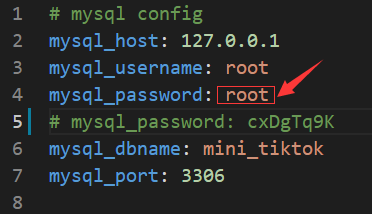

# Mini-tiktok

Hi there, this is a project for practice during the Byte Dance Youth Camp for backend.

This repository is the result of Team BDXA0429.

For Monolith, we choose gin+gorm+mysql+redis+mvc framework to complete the work.


## Microservices

in future planning


## Monolith

### DOC

https://v9drif9kn4.feishu.cn/docx/doxcnnC7wuakE7YrDcYuNGrF7LZ

### Project structure

```
Monolith
├── app                   
│   ├── controller        
│   ├── service           
│   └── entity             
|   └── dao
├── common
│   ├── auth              // generate token           
│   ├── db                // mysql & redis init
│   ├── xerr              // customed errors
│   ├── logger            
│   └── utils             // snow flake algorithm to generate unique id
├── router                
│   ├── middleware        // auth and log midderware 
│   └── router.go
├── config.yaml           // app config
├── go.mod                
├── go.sum
├── main.go               
├── run.sh
```

### How to run

#### 1. Install mysql

The mysql installation tutorial is omitted here.

Notice: you need replace the `mysql_password` with your own password.




#### 2. Install redis

```shell
wget https://download.redis.io/redis-stable.tar.gz
tar -zvxf redis-stable.tar.gz
mv redis-stable /usr/local/redis
cd /usr/local/redis
make
make test
make PREFIX=/usr/local/redis install
./bin/redis-server&
```

#### 3. Install ffmpeg

```shell
wget http://www.tortall.net/projects/yasm/releases/yasm-1.3.0.tar.gz
tar zxvf yasm-1.3.0.tar.gz
cd yasm-1.3.0
./configure
make
sudo make install


wget http://www.ffmpeg.org/releases/ffmpeg-3.1.tar.gz
tar -zxvf ffmpeg-3.1.tar.gz
cd ffmpeg-3.1
./configure --prefix=/usr/local/ffmpeg
make && sudo make install
vim /etc/profile
export PATH=$PATH:/usr/local/ffmpeg/bin
source /etc/profile
```

#### 4. Build an run

```shell
git clone https://github.com/zchaoyu1126/mini-tiktok.git
cd Monolith
go env -w GO111MODULE=on
go env -w GOPROXY=https://goproxy.cn,direct
go mod init mini-tiktok
go mod tidy
go build .
sh run.sh
```

### Register a service

```shell
vim /lib/systemd/system/mini-tiktok.service
```

```shell
[Unit]
Description=mini-tiktok

[Service]
Type=simple
Restart=always
RestartSec=3s
ExecStart=sh root/mini-tiktok/Monolith/run.sh

[Install]
WantedBy=multi-user.target
```

After completing the registration, you can use the following command to **start** or **restart** or **stop** the service rather than `sh run.sh`.

```shell
service mini-tiktok start
service mini-tiktok restart
service mini-tiktok stop
service mini-tiktok status
```


